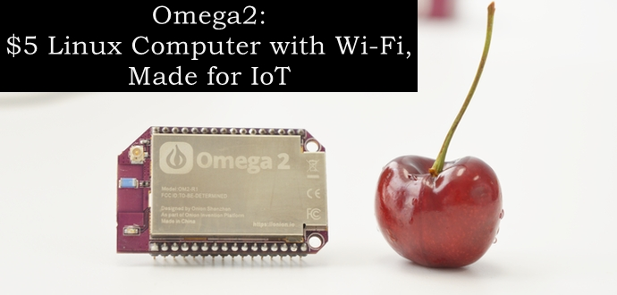
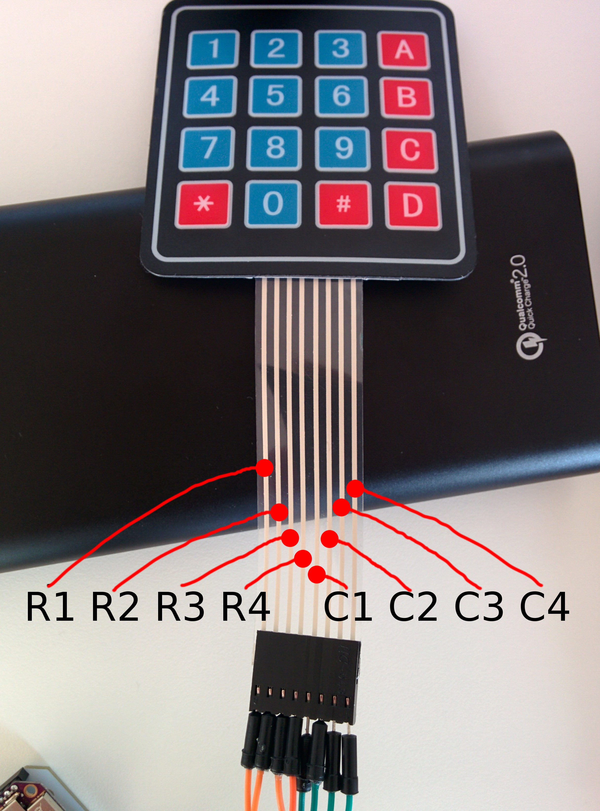

# Onion omega2 Keypad

Use onion omega2 with 16 keys membrane switch keypad matrix 4X4 buttons

## Programming language
python 2.7

## Connect onion omega2 and keypad
###Keypad R1 = Omega2 GPIO 0
###Keypad R2 = Omega2 GPIO 1
###Keypad R3 = Omega2 GPIO 2
###Keypad R4 = Omega2 GPIO 3
###Keypad C1 = Omega2 GPIO 18
###Keypad C2 = Omega2 GPIO 11
###Keypad C3 = Omega2 GPIO 8 
###Keypad C4 = Omega2 GPIO 9

## Where to buy the keypad
10 pcs High Quality 4x4 Matrix Array 16 Key Membrane Switch Keypad Keyboard Control Panel Microprocessor Keyboard for Arduino 
## Price
US $5.30 / lot  10 pieces / lot , US $0.53 / piece) 

https://www.aliexpress.com/item/10-pcs-High-Quality-4x4-Matrix-Array-16-Key-Membrane-Switch-Keypad-Keyboard-Control-Panel-Microprocessor/1719026531.html

## Demo

## Copyright
Copyright 2017 Michael Jentsch

Licensed under the Apache License, Version 2.0 (the "License");
you may not use this file except in compliance with the License.
You may obtain a copy of the License at

   http://www.apache.org/licenses/LICENSE-2.0

Unless required by applicable law or agreed to in writing, software
distributed under the License is distributed on an "AS IS" BASIS,
WITHOUT WARRANTIES OR CONDITIONS OF ANY KIND, either express or implied.
See the License for the specific language governing permissions and
limitations under the License.
